# Wireless Ferris Sweep

- Note: I have not made the PCB myself
- The PCB was taken from the repo: https://github.com/davidphilipbarr/sweep
- ZMK Config: http://github.com/aditya23043/zmk-config
- Fully Wireless build with a ZMK dongle

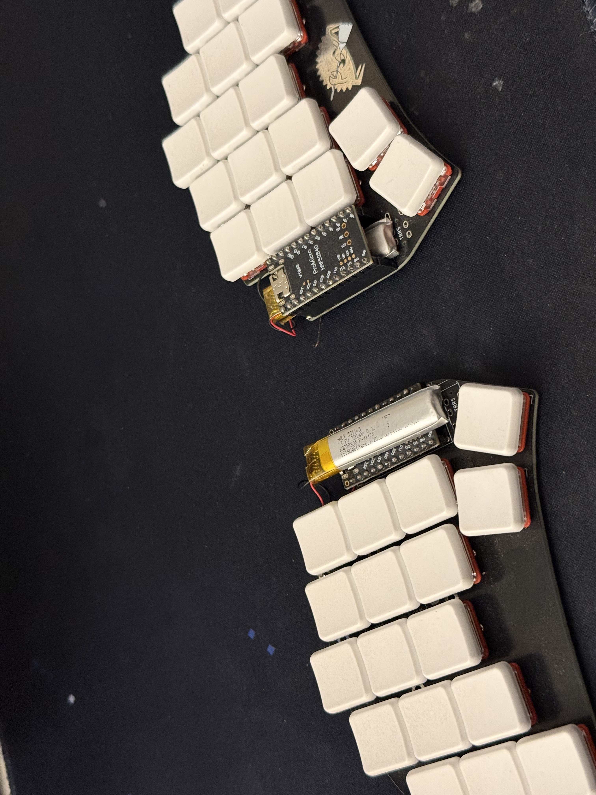

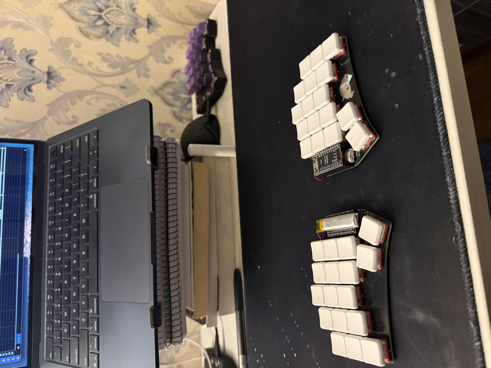

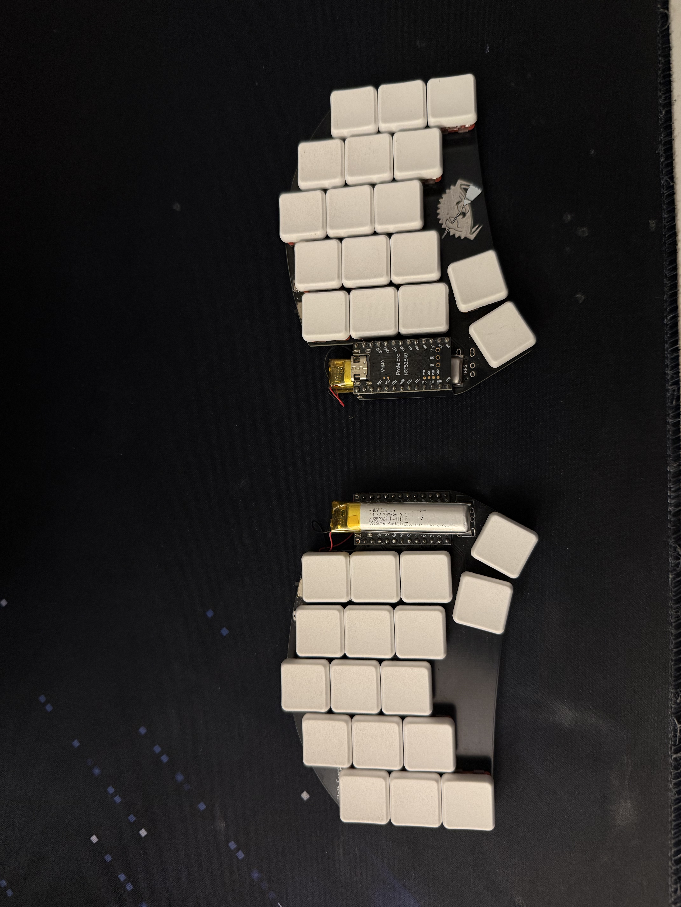

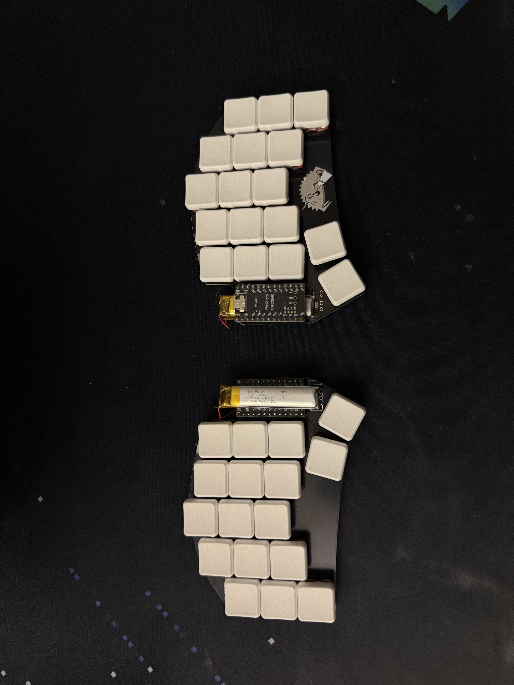

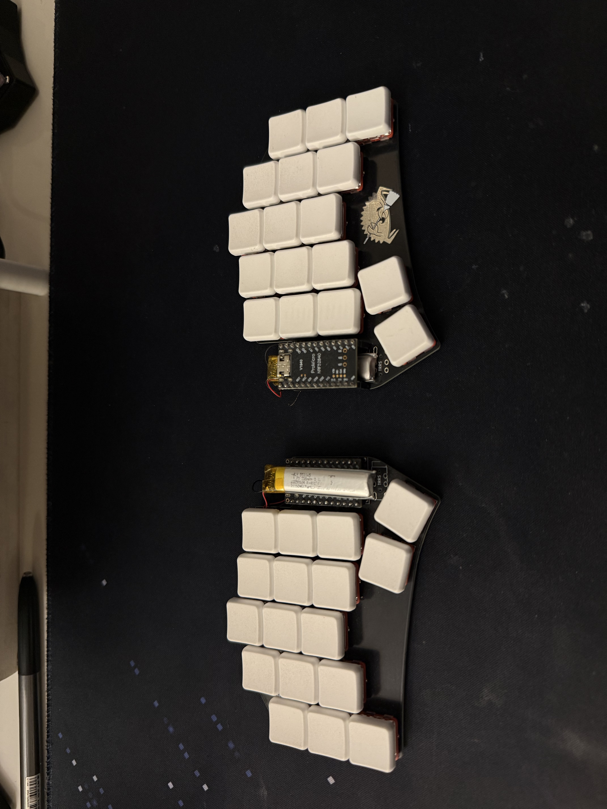

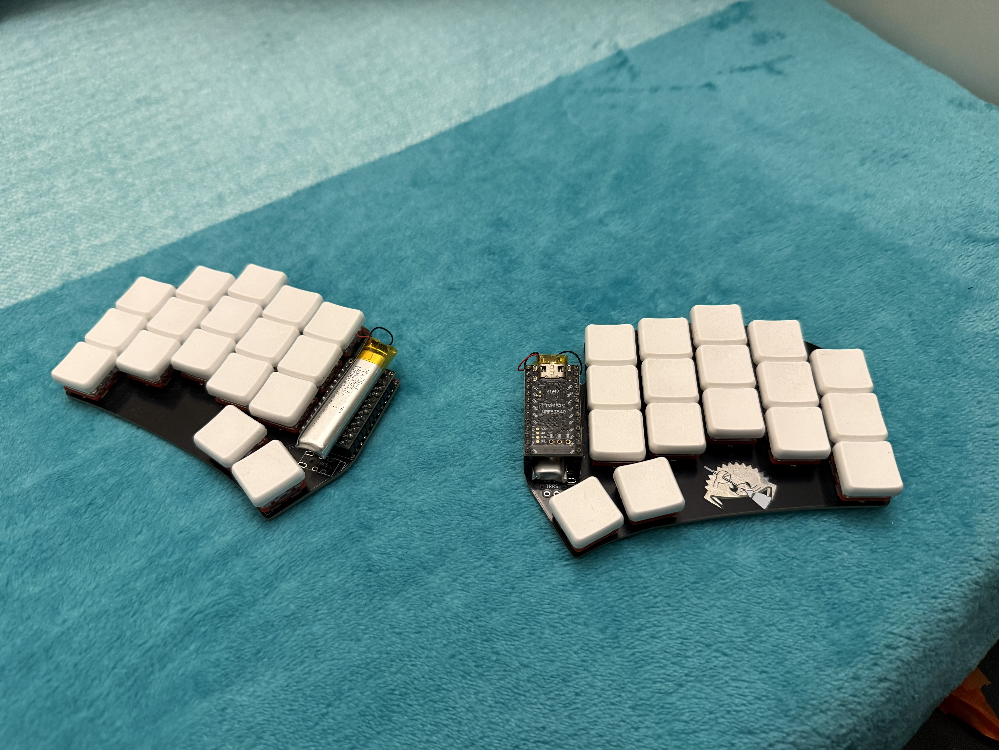

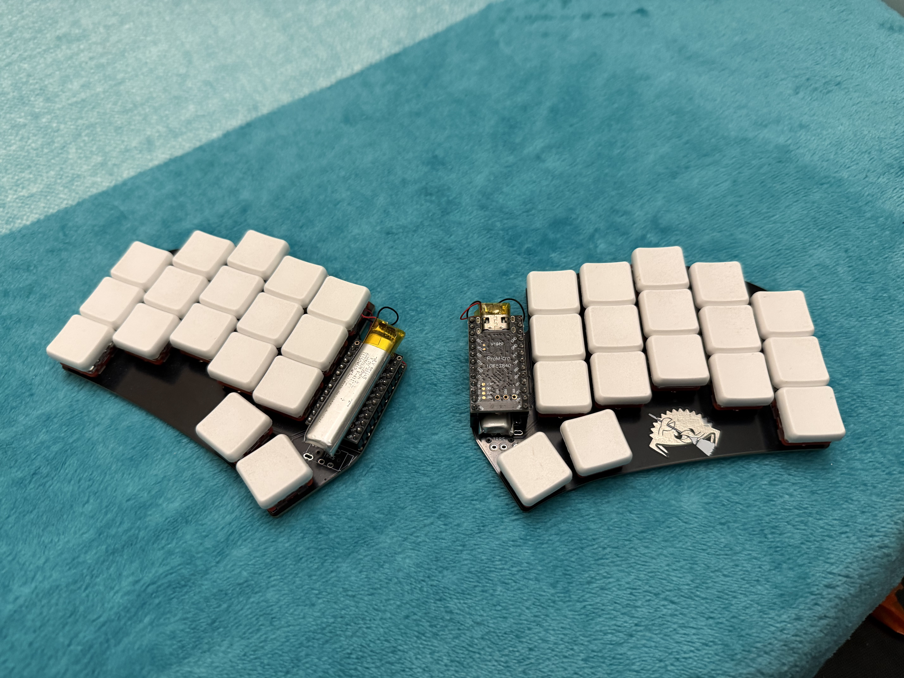

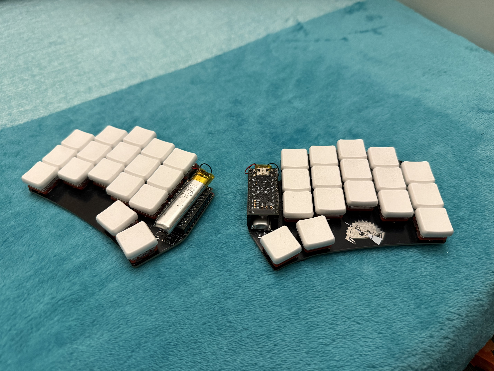

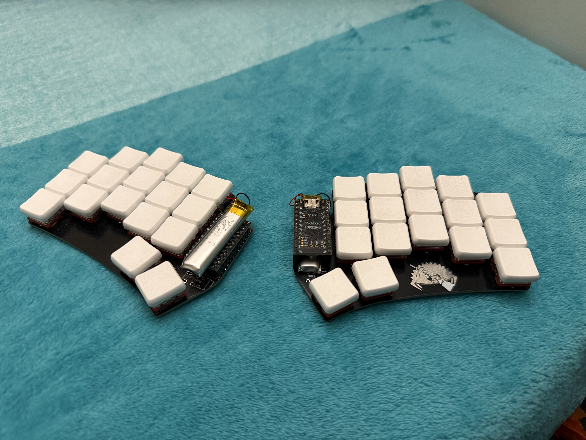

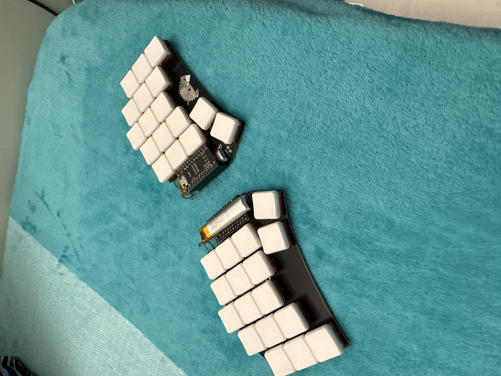

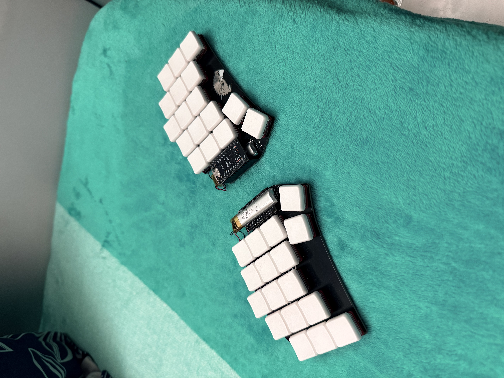

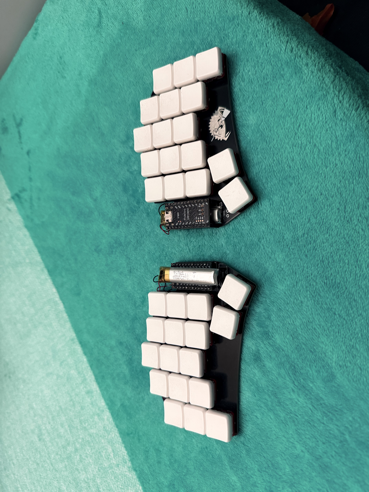

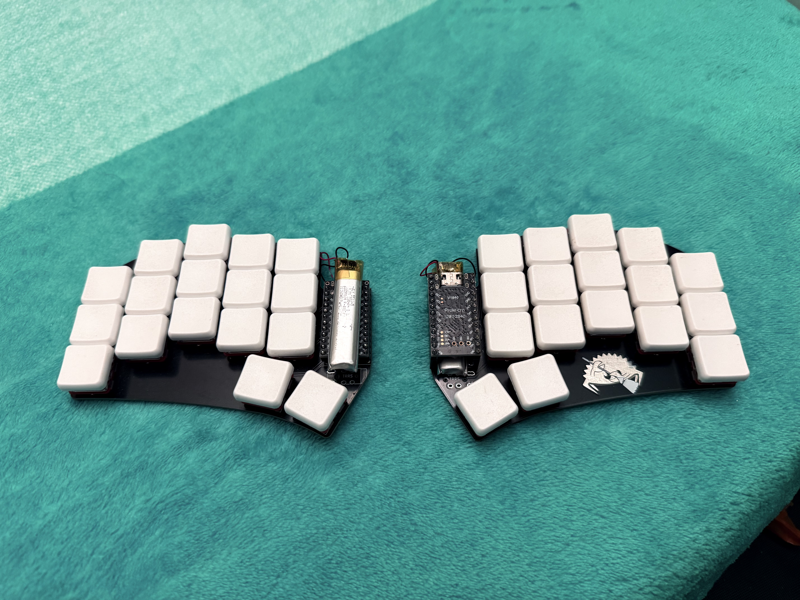
